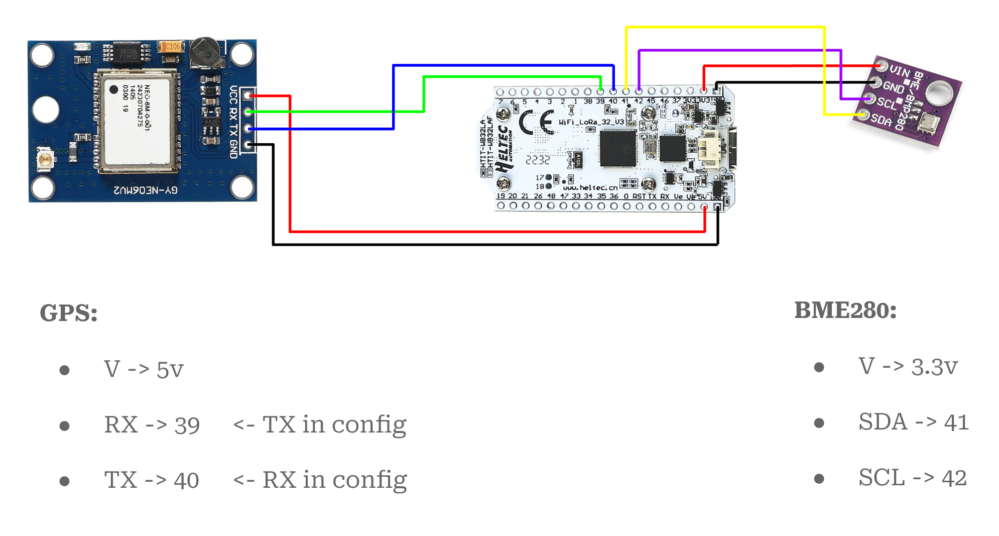

On October 25, 2025 we're hosting a Meshtastic workshop at BSides PDX: we're dubbing it meshSides '25. If you're there, you received this hardware kit for your cost of entry:

On this page you'll find all the resources used for the workshop.

<!-- toc -->

- [1. Introduction & Overview](#1-introduction--overview)
    * [Hardware kit contents](#hardware-kit-contents)
- [2. Installation](#2-installation)
    * [Flashing with `esptool`](#flashing-with-esptool)
    * [Flashing with Web flasher](#flashing-with-web-flasher)
- [3. Basic functionality](#3-basic-functionality)
    * [Meshtastic clients](#meshtastic-clients)
- [4. Telemetry](#4-telemetry)
- [5. Advanced features](#5-advanced-features)
    * [Antennas](#antennas)
- [6. How to keep progressing](#6-how-to-keep-progressing)
    * [Show and tell](#show-and-tell)
- [Extra resources](#extra-resources)
    * [Troubleshooting](#troubleshooting)
    * [Communities](#communities)
    * [Relevant projects](#relevant-projects)
    * [Other](#other)

<!-- tocstop -->

# 1. Introduction & Overview

- [Introductory Montage video](https://www.youtube.com/watch?v=fmEhItNW0Q0)
- Workshop recording - TBA depending on availability
- [Google Slides we use for guiding the workshop](https://docs.google.com/presentation/d/1NV6DDtEID5ZnrtPdnQmO0WdO0rxEEhatJCHDJl_QeSA/edit)

## Hardware kit contents

- [Heltec v3 product page](https://heltec.org/project/wifi-lora-32-v3/)
- [NEO-6MV2GPS module details](https://components101.com/modules/neo-6mv2-gps-module)
- [HC-SR04 ultrasonic distance sensor details](https://projecthub.arduino.cc/Isaac100/getting-started-with-the-hc-sr04-ultrasonic-sensor-7cabe1)
- [BME-280 environmental sensor details](https://randomnerdtutorials.com/bme280-sensor-arduino-pressure-temperature-humidity/)

# 2. Installation

## Flashing with `esptool`

1. Download an appropriate [ESPTool binary](https://github.com/espressif/esptool/releases/tag/v4.10.0)
1. Download our [event firmware binary](https://drive.google.com/drive/folders/1UPdN6XeaiWWb94XXDGoKej2iUTjExevO)
1. `./esptool write_flash -e 0x0 bsides-pdx-firmware-2.6.11.bin`

Source code for the [custom firmware is available](https://github.com/Cool-Consulting-LLC/meshtastic-firmware) for perusing and pull requests.

## Flashing with Web flasher

1. [Meshtastic Web flasher](https://flasher.meshtastic.org/)
1. Follow instructions within for official firmware

[Official flashing instructions](https://meshtastic.org/docs/getting-started/) are available as well.

# 3. Basic functionality

## Meshtastic clients

- [CLI](https://meshtastic.org/docs/software/python/cli/installation/)
- [Web UI Client](https://client.meshtastic.org/)
- [Android apps](https://meshtastic.org/docs/software/android/installation/)
- [iOS app](https://apple.co/3Auysep)
- [Fun quirks](https://github.com/meshtastic/firmware/issues/5079)

# 4. Telemetry

- [GPS bit stripping for precision](https://docs.rs/meshtastic/latest/meshtastic/protobufs/struct.Position.html#structfield.precision_bits)

# 5. Advanced features

- [Remote node administration](https://meshtastic.org/docs/configuration/remote-admin/)
- [Ultrasonic distance sensor Meshtastic support](https://meshtastic.org/docs/configuration/module/telemetry/#:~:text=RCWL9620,Ultrasonic%20Distance%20Sensor)

To enable I2C on the sensor, short M2 by soldering it together (more details on the back of the sensor).

- [Mesh Marauder](https://meshmarauder.net/)

## Antennas

- [Meshtastic antenna documentation](https://meshtastic.org/docs/hardware/antennas/)
- [LoRa Propagation talk (The Things Conference, 2019)](https://www.youtube.com/watch?v=BOc3N3Yl38o)

# 6. How to keep progressing

## Show and tell

- We [customized](https://github.com/Cool-Consulting-LLC/meshsides-bbs) an existing [TC2-BBS](https://github.com/TheCommsChannel/TC2-BBS-mesh/) project for BSides PDX. Connect to it on the default LongFast channel: `meshSides '25 BBS` aka `MS25`.
- [Seeed T1000-e product page](https://www.seeedstudio.com/SenseCAP-Card-Tracker-T1000-E-for-Meshtastic-p-5913.html)
- [Meshtastic documentation on Remote Hardware](https://meshtastic.org/docs/configuration/module/remote-hardware/)

# Extra resources

## Troubleshooting

- [Meshtastic Firmware](https://github.com/meshtastic/firmware)
- [Meshtastic CLI](https://github.com/meshtastic/python)
- [Meshtastic Web flasher](https://github.com/meshtastic/web-flasher)

## Communities

- [Meshtastic Discord](https://discord.com/invite/meshtastic)
- [PDXMesh community (Portland)](https://discord.com/invite/y4R5sHPqaU)
- [PugetMesh community (WA)](https://pugetmesh.org/)

## Relevant projects

- [LLM-Meshtastic bridge](https://github.com/fiquett/llm-meshtastic-bridge)
- [BBS Mesh Scripts for Meshtastic](https://github.com/SpudGunMan/meshing-around)
- [Haruki’s Meshtastic Experiments](https://harukitoreda.github.io/Meshtastic-Experiments/)

## Other

- [Workshop feedback form](https://meshsides-feedback.coolconsulting.lol)
- [Smiling Friends video from intermission](https://www.youtube.com/watch?v=KFmLnprKRo0)
